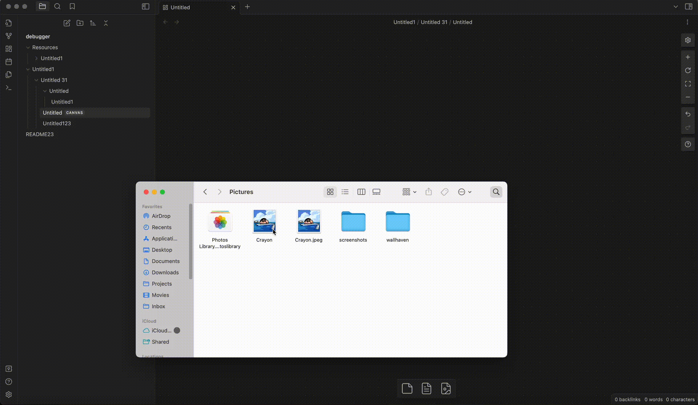

# Obsidian Attachment Management

This plugin support to more flexibly to setting your attachment location with variable `${notepath}`, `${notename}`, `${date}`.

## Features

This plugin currently support:

- [x] Setting the attachment location with `${notepath}`, `${notename}`, `${date}`
- [x] Auto-rename the attachment when paste file to `markdown` or `canvas`
- [x] Auto-rename the attachment file or folder while your rename the article (`markdown` or `canvas`) file
- [x] Auto-rename the attachment when drop file to `markdown` or `canvas`
- [x] Re-Arrange the attachment file that linked by `markdown` or `canvas` to corresponding path as you configured (experimental)
- [ ] Processing duplicate attachment
- [ ] Override attachment configuration for specified notes or folder

## How to install

- Install from Obsidian community plugins (under [open pull request](https://github.com/obsidianmd/obsidian-releases/pull/1947)).
- Clone this repo
  - `npm i` or `yarn` to install dependencies
  - `npm run build` to start compilation in watch mode.
  - Copy the `main.js` and `manifest.json` files to your vault `VaultFolder.obsidian/plugins/obsidian-attachment-management`

## Settings

The path of attachment was compose of three part

```
{root path}/{attachment path}/{attachment name}.extension
```

And your can use the variables below to config

- `${notepath}`: file path of the `markdown` or `canvas` file under the vault root.
- `${notename}`: file name of the `markdown` or `canvas` file (not include file extension).
- `${date}`: date time format by [Moment format options](https://momentjscom.readthedocs.io/en/latest/moment/04-displaying/01-format)

### Root Path to Save New Attachments

You must select a root folder to save the associated attachment of a `markdown` or `canvas` file.


It can be set use the config of obsidian in `Files & Links`, or reset in this option.

- Copy Obsidian settings: use the config of obsidian in `Files & Links`.
- In the folder specified below: set a fixed folder.
- Next to note in folder specified below: in the subfolder of current `markdown` or `canvas` file.

### Attachment Path

A sub-folder to place attachment under the `{root path}`, available variables `${notename}` and `${notepath}`, default value `${notepath}/${notename}`.

### Attachment Format

Set how to rename the attachment, available variables `${notename}` and `${date}`, default value `IMG-{date}`.

### Date Format

Use [Moment format options](https://momentjscom.readthedocs.io/en/latest/moment/04-displaying/01-format) to set the `${date}`, default value `YYYYMMDDHHmmssSSS`.

### Handle All Attachments

By default, only auto-rename the image file, if enable this option, all created file (except `md` or `canvas`) will be renamed automatically

#### Exclude Extension Pattern

This option is only useful when "Handle all attachments" is enabled. Write a Regex pattern to exclude certain extensions from being handled.


### Automatically Rename Attachment

Automatically rename the attachment folder/filename when you rename the folder/filename where the corresponding md/canvas file be placed.

## Usage

Install and enable the plugin, after configure you can paste or drop attachment file as usually and it will be auto rename.

This plugin support a command `Rearrange Linked Attachments`, if you run this command, it will rename all attachment that has bee linked in `markdown` or `canvas` file as you configured.


**Notice** The `Rearrange Linked Attachments` was currently a experimental feature, if you want to try out, it's better to backup your files at first.

### Known Issues

- When drop a file in `canvas`, it's will delay to show the updated link/filename.


